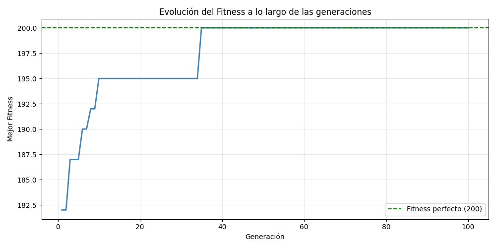
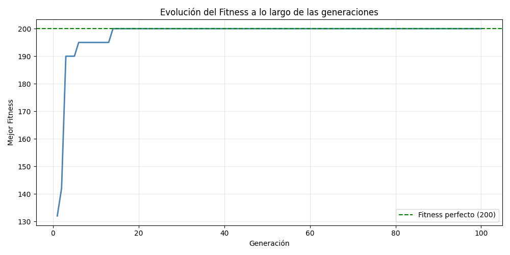
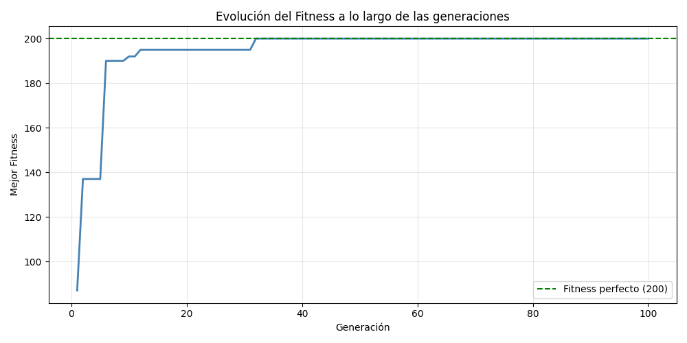
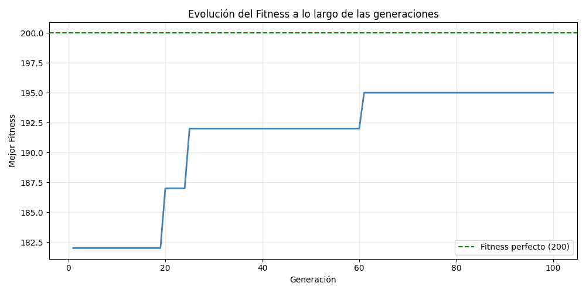
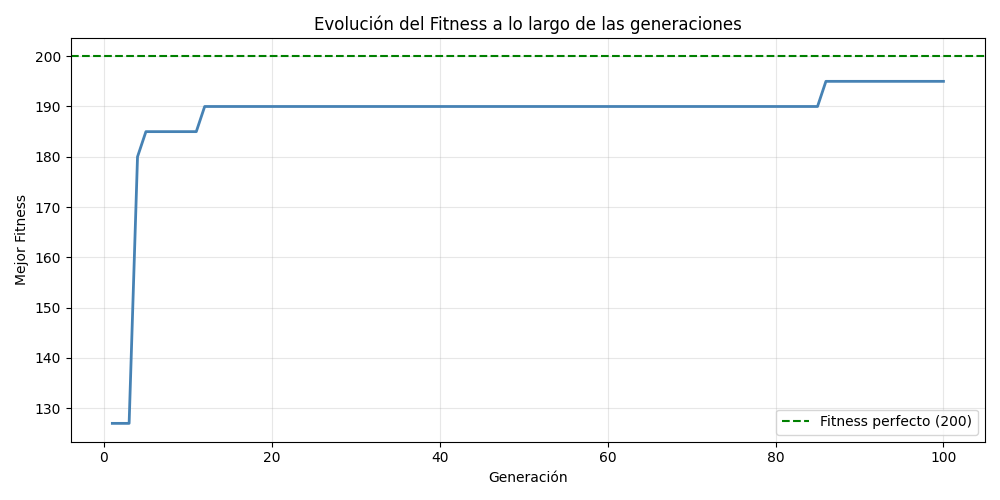
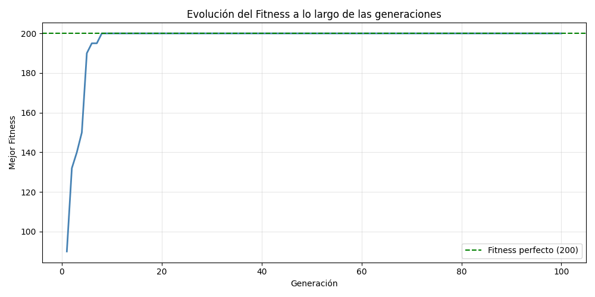

# Algoritmo A* para Navegación en Campus

## Descripción del problema

Se implementó el algoritmo A* para encontrar el camino de menor costo entre puntos del campus universitario, representado como una grilla 2D con edificios (B30–B38, Cafetería, Biblioteca), pasillos y paredes.

El estado del agente es una tupla `(x, y, piso)`. Las acciones disponibles son movimientos en el plano (costo 1), ascensor (costo 3) y escaleras (bajar: costo 5, subir: costo 7+p). La heurística usada es la **distancia euclídea** en el plano 2D, ignorando el piso.

---

## Arquitectura del código

El problema se modeló con cuatrp clases principales:

| Clase | Responsabilidad |
|---|---|
| `Node` | Representa un nodo en el árbol de búsqueda. Guarda `state`, `parent`, `action`, `g`, `h` y `f`. Permite reconstruir el camino con `path()` y `actions()`. |
| `Problem` | Clase base abstracta que define la interfaz: `actions()`, `result()`, `is_goal()`, `heuristic()`. |
| `CampusProblem` | Subclase concreta que implementa la lógica del campus: qué celdas son transitables, cómo funcionan ascensores y escaleras, y la heurística euclídea. |
| `AStarSearch` | Ejecuta A* sobre cualquier subclase de `Problem`. Mantiene un heap por `f` y un conjunto de estados visitados por `g`. |

---

## Parámetros del algoritmo

| Parámetro | Valor |
|---|---|
| Heurística | Distancia euclídea 2D (sin piso) |
| Costo movimiento plano | 1 por celda |
| Costo ascensor | 3 por piso |
| Costo bajar escaleras | 5 |
| Costo subir escaleras | 7 + p (p = pisos a subir) |
| Edificios con ascensor | B32, B33, B35, B37, B38 |

---

## Resultados por caso

### Caso 1 │ B30 piso 1 → Cafetería piso 1

```
Inicio:  coord=(2, 2)  piso 1  [B30]
Destino: coord=(6, 10) piso 1  [Cafetería]
```

**Ruta (12 acciones):** abajo, abajo, derecha, derecha, abajo, abajo, derecha, abajo, abajo, abajo, abajo, derecha

**Mapa del camino:**
```
╔══ MAPA DEL CAMPUS (piso 1) ══════════════════════════════════╗
  S = Inicio [B30]    G = Goal [Cafetería]    · = Camino

     0   1   2   3   4   5   6   7   8   9   10  11  12  13  14  15  16
     ────────────────────────────────────────────────────────────────────
y=2  │        S           B31         B32         B33         B34
y=3  │    #   ·   #   #       #       #   #       #       #       #
y=4  │    #   ·   ·   ·       #       #           #       #       #
y=5  │            #   ·                   #                       #
y=6  │    #           B35 ·   #       B36     #       B37     #       B38
y=7  │    #   #       #   ·   #       #       #       #       #
y=8  │                #   ·           #               #
y=9  │#   #       #   #   ·   #               #       #       #   #
y=10 │                #   ·   G       #       #               BIB
╚═══════════════════════════════════════════════════════════════╝
```

**✓ Costo total: 12**

---

### Caso 2 │ Cafetería piso 1 → Biblioteca piso 1

```
Inicio:  coord=(6, 10)  piso 1  [Cafetería]
Destino: coord=(14, 10) piso 1  [Biblioteca]
```

**Ruta (12 acciones):** derecha, abajo, abajo, derecha, derecha, derecha, derecha, derecha, derecha, arriba, arriba, derecha

**Mapa del camino:**
```
╔══ MAPA DEL CAMPUS (piso 1) ══════════════════════════════════╗
  S = Inicio [Cafetería]    G = Goal [Biblioteca]    · = Camino

     0   1   2   3   4   5   6   7   8   9   10  11  12  13  14  15  16
     ────────────────────────────────────────────────────────────────────
y=10 │                #       S   ·   #       #           ·   G
y=11 │    #   #       #       #   ·   #       #       #   ·   #
y=12 │                            ·   ·   ·   ·   ·   ·   ·
╚═══════════════════════════════════════════════════════════════╝
```

**✓ Costo total: 12**

---

### Caso 3 │ B32 piso 1 → B37 piso 3 (con ascensor)

```
Inicio:  coord=(8, 2)  piso 1  [B32]
Destino: coord=(12, 6) piso 3  [B37]
```

**Ruta (10 acciones):** derecha, derecha, abajo, abajo, abajo, derecha, derecha, abajo, subir_ascensor, subir_ascensor

**Secuencia de valores g, h, f:**

| Estado | Lugar | g | h | f |
|---|---|---|---|---|
| (8,2,1) | B32 | 0 | 5.66 | 5.66 |
| (10,5,1) | Pasillo | 5 | 2.24 | 7.24 |
| (12,6,1) | B37 | 8 | 0.00 | 8.00 |
| (12,6,2) | B37 | 11 | 0.00 | 11.00 |
| (12,6,3) | B37 | 14 | 0.00 | 14.00 |

**Mapa del camino:**
```
╔══ MAPA DEL CAMPUS (piso 1) ══════════════════════════════════╗
  S = Inicio [B32]    G = Goal [B37]    · = Camino

     0   1   2   3   4   5   6   7   8   9   10  11  12  13  14  15  16
     ────────────────────────────────────────────────────────────────────
y=2  │        B30         B31         S   ·   ·   B33         B34
y=3  │    #       #   #       #       #   #   ·   #       #       #
y=4  │    #                   #       #       ·   #       #       #
y=5  │            #                       #   ·   ·   ·           #
y=6  │    #           B35     #       B36     #       G       #       B38
╚═══════════════════════════════════════════════════════════════╝
```

> El agente llega a B37 en piso 1 (g=8) y sube dos veces por ascensor (costo 3 cada vez) hasta piso 3.

**✓ Costo total: 14**

---

### Caso 4 │ B38 piso 2 → B35 piso 1

```
Inicio:  coord=(16, 6) piso 2  [B38]
Destino: coord=(4, 6)  piso 1  [B35]
```

**Ruta (21 acciones):** bajar_ascensor, arriba ×4, izquierda ×9, abajo ×3, izquierda ×3, abajo

**Mapa del camino:**
```
╔══ MAPA DEL CAMPUS (piso 1) ══════════════════════════════════╗
  S = Inicio [B38]    G = Goal [B35]    · = Camino

     0   1   2   3   4   5   6   7   8   9   10  11  12  13  14  15  16
     ────────────────────────────────────────────────────────────────────
y=2  │        B30         B31     ·   B32 ·   ·   B33 ·   ·   B34 ·   ·
y=3  │    #       #   #       #   ·   #   #       #       #       #   ·
y=4  │    #                   #   ·   #           #       #       #   ·
y=5  │            #   ·   ·   ·   ·       #                       #   ·
y=6  │    #           G       #       B36     #       B37     #       S
╚═══════════════════════════════════════════════════════════════╝
```

> El agente primero baja por ascensor de piso 2 a piso 1 (costo 3), luego navega por el campus hasta B35.

**✓ Costo total: 23**

---

## Resumen comparativo

| Caso | Inicio | Destino | Acciones | Costo total |
|---|---|---|---|---|
| 1 | B30 piso 1 | Cafetería piso 1 | 12 | 12 |
| 2 | Cafetería piso 1 | Biblioteca piso 1 | 12 | 12 |
| 3 | B32 piso 1 | B37 piso 3 | 10 | 14 |
| 4 | B38 piso 2 | B35 piso 1 | 21 | 23 |

---

## Conclusiones

**A* encuentra el camino óptimo gracias a la admisibilidad de la heurística.** La distancia euclídea nunca sobreestima el costo real (que sigue los pasillos de la grilla), lo que garantiza que el primer camino que llega al goal es el de menor costo. Esto se puede verificar en los casos 1 y 2: ambos tienen el mismo costo (12) aunque sus rutas en el mapa son completamente distintas.

**El costo de cambiar de piso domina cuando está involucrado el ascensor.** En el caso 3, el agente recorre 8 celdas en el plano (costo 8) y luego sube 2 pisos por ascensor (costo 6), para un total de 14. A* prefiere llegar primero al edificio correcto y subir ahí, en vez de subir en un edificio intermedio y caminar en otro piso, porque la heurística no penaliza la diferencia de piso.

**El caso más costoso (Caso 4) refleja una limitación del mapa, no del algoritmo.** B38 y B35 están en extremos opuestos del campus y la grilla tiene muchas paredes intermedias, lo que obliga a dar un rodeo por la fila y=2 antes de bajar. El costo de 23 es el óptimo real dado el mapa, y A* lo encuentra correctamente.

---

# Algoritmo Genético para Planificación de Horarios

## Descripción del problema

Se implementó un algoritmo genético para asignar **8 cursos** a **5 bloques de tiempo** y **3 salones**, respetando restricciones duras (sin solapamiento de salones, capacidad suficiente, profesores compartidos) y restricciones blandas (preferencia por horarios tempranos y uso eficiente de salones).

Cada individuo se representa como una lista de 8 tuplas `(bloque, salón)`, una por curso. La función de fitness parte de 200 puntos y penaliza las violaciones encontradas.

---

## Parámetros del algoritmo

| Parámetro | Valor |
|---|---|
| Tamaño de población | 30 individuos |
| Número de generaciones | 100 |
| Probabilidad de mutación | 20% |
| Selección | Torneo (3 participantes) |
| Elitismo | 2 mejores pasan directos |
| Cruce | Un punto aleatorio |

---

## Resultados por corrida

### Corrida 1

**Fitness inicial:** 182 — **Fitness final:** 200 ✅ — **Generación de convergencia:** ~41



**Horario final obtenido:**

| Curso | Bloque | Salón | Capacidad | Estudiantes |
|---|---|---|---|---|
| MAT | Mie 8-10 | C | 50 | 45 |
| FIS | Lun 8-10 | A | 40 | 30 |
| QUI | Lun 8-10 | C | 50 | 35 |
| PRG | Lun 10-12 | A | 40 | 40 |
| LIT | Lun 8-10 | B | 30 | 25 |
| HIS | Lun 10-12 | B | 30 | 30 |
| ING | Mie 8-10 | A | 40 | 35 |
| EDF | Lun 10-12 | C | 50 | 50 |

---

### Corrida 2

**Fitness inicial:** 132 — **Fitness final:** 200 ✅ — **Generación de convergencia:** ~21



**Horario final obtenido:**

| Curso | Bloque | Salón | Capacidad | Estudiantes |
|---|---|---|---|---|
| MAT | Lun 10-12 | C | 50 | 45 |
| FIS | Lun 8-10 | B | 30 | 30 |
| QUI | Lun 8-10 | A | 40 | 35 |
| PRG | Mie 8-10 | A | 40 | 40 |
| LIT | Lun 10-12 | B | 30 | 25 |
| HIS | Lun 10-12 | A | 40 | 30 |
| ING | Mie 8-10 | C | 50 | 35 |
| EDF | Lun 8-10 | C | 50 | 50 |

---

### Corrida 3

**Fitness inicial:** 87 — **Fitness final:** 200 ✅ — **Generación de convergencia:** ~41



**Horario final obtenido:**

| Curso | Bloque | Salón | Capacidad | Estudiantes |
|---|---|---|---|---|
| MAT | Lun 10-12 | C | 50 | 45 |
| FIS | Lun 8-10 | A | 40 | 30 |
| QUI | Mie 8-10 | A | 40 | 35 |
| PRG | Lun 8-10 | C | 50 | 40 |
| LIT | Lun 8-10 | B | 30 | 25 |
| HIS | Mie 8-10 | B | 30 | 30 |
| ING | Lun 10-12 | A | 40 | 35 |
| EDF | Mie 8-10 | C | 50 | 50 |

---

## Resumen comparativo

| | Corrida 1 | Corrida 2 | Corrida 3 |
|---|---|---|---|
| Fitness inicial | 182 | 132 | 87 |
| Fitness final | 200 | 200 | 200 |
| Convergencia (gen.) | ~41 | ~21 | ~41 |
| Restricciones duras violadas | 0 | 0 | 0 |

Las tres corridas alcanzaron el **fitness perfecto de 200**, confirmando que el algoritmo encuentra consistentemente soluciones válidas sin importar la calidad del punto de partida.

---
## Preguntas de análisis

**¿En qué generación aproximadamente el algoritmo encontró una solución válida (sin violar restricciones duras)?:**
En las tres corridas el algoritmo encontró una solución válida (fitness 200, sin violar ninguna restricción dura) antes de la generación 41. La corrida 2 fue la más rápida, convergiendo alrededor de la generación 21. Esto indica que con una población de 30 individuos y 100 generaciones, el algoritmo tiene margen de sobra para encontrar el óptimo.

**¿Por qué es importante que las restricciones duras tengan penalizaciones más grandes (-50) que las blandas (-3 a -5)?**
Porque la función de fitness guía al algoritmo hacia dónde buscar. Si las penalizaciones duras fueran del mismo orden que las blandas, un individuo con varios conflictos de salón pero buenos horarios podría tener un puntaje similar a uno completamente válido, y el algoritmo no distinguiría claramente cuál es mejor. Con -50 por violación dura, esos individuos quedan tan por debajo que la selección por torneo los descarta consistentemente, forzando la evolución hacia soluciones legales primero.

**¿Qué sucedería si aumentáramos la tasa de mutación a 0.8 (80%)? ¿Mejoraría o empeoraría el algoritmo?**

### Corrida 4

**Fitness inicial:** 182 — **Fitness final:** 195 ✅ — **Generación de convergencia:** ~51



**Horario final obtenido:**

| Curso | Bloque | Salón | Capacidad | Estudiantes |
|---|---|---|---|---|
| MAT | Mie 8-10  | C | 50 | 45 |
| FIS | Vie 8-10 | B | 30 | 30 |
| QUI | Mie 8-10 | A | 40 | 35 |
| PRG | Lun 10-12 | A | 40 | 40 |
| LIT | Mie 8-10 | B | 30 | 25 |
| HIS | Lun 8-10  | B | 30 | 30 |
| ING | Lun 10-12 | C | 50 | 35 |
| EDF | Lun 8-10 | C | 50 | 50 |

---

El algoritmo empeora. Con 80% de probabilidad, casi todos los genes de cada individuo cambiarían en cada generación, destruyendo las combinaciones buenas que el cruce y la selección lograron construir. El elitismo protegería a los 2 mejores, pero el resto de la población se regeneraría casi aleatoriamente en cada generación, haciendo que el algoritmo se comporte más como una búsqueda aleatoria que como una búsqueda dirigida.

**Experimenta con poblaciones de 10, 30 y 50 individuos. ¿Qué observas en términos de velocidad de convergencia y calidad de la solución?**

## 4. Tamaño de Población

Se experimentó con poblaciones de 10, 30 y 50 individuos. Los resultados fueron:

| Tamaño | Fitness inicial | Fitness final | Convergencia (gen.) |
|---|---|---|---|
| 10 | 127 | 195 ❌ | No alcanzó 200 |
| 30 | 140 | 200 ✅ | ~11 |
| 50 | 90 | 200 ✅ | ~11 |

### Población: 10 individuos


Con solo 10 individuos el algoritmo **no logró alcanzar el fitness perfecto de 200** 
en 100 generaciones, quedándose en 195. La gráfica muestra una curva que sube 
rápido al principio pero luego se estanca durante decenas de generaciones antes de 
dar un pequeño salto tardío cerca de la generación 85. Esto evidencia pérdida de 
diversidad genética temprana: la población converge a una solución subóptima y le 
cuesta escapar de ella.

### Población: 30 individuos


Con 30 individuos el algoritmo alcanzó fitness 200 ya en la generación 11, 
manteniéndolo estable el resto de la ejecución. La curva es empinada y limpia, 
sin estancamientos visibles.

### Población: 50 individuos


Con 50 individuos el resultado fue igual de bueno: fitness 200 desde la generación 
11, con una curva de convergencia prácticamente idéntica a la de 30. Cabe resaltar que inició 
con una población con menor fitness que la población de 20 individuos.

El caso de 10  demuestra que por debajo de cierto umbral de diversidad el algoritmo se queda 
atrapado en óptimos locales y no garantiza encontrar la solución perfecta. Sobre las poblaciones de
30 y 50 se nota que alcanzan rápidamente el fitness perfecto, sobretodo la población de 50 que
inicia con un fitness peor. 

## Conclusiones

**El algoritmo converge de forma robusta independientemente del punto de partida.** La corrida 3 comenzó con un fitness de apenas 87 —la peor población inicial de las tres—, con múltiples violaciones de restricciones duras, y aun así alcanzó el óptimo en las mismas generaciones que la corrida 1, que partió desde un estado mucho más favorable (182). Esto sugiere que la combinación de elitismo, selección por torneo y mutación del 20% es suficiente para escapar de poblaciones iniciales muy malas.

**La mayor parte del aprendizaje ocurre en las primeras 20-40 generaciones.** En las tres corridas la curva de fitness sube abruptamente al principio y luego se estabiliza en 200, donde permanece el resto de la ejecución. Esto indica que 100 generaciones son más que suficientes para este problema, y que probablemente podría reducirse a 50 sin perder calidad en la solución.

**El algoritmo produce horarios diferentes en cada corrida, todos igualmente válidos.** Aunque el fitness final es idéntico (200) en los tres casos, los horarios concretos difieren: por ejemplo, MAT termina en Mie 8-10 (Corrida 1) o Lun 10-12 (Corridas 2 y 3). Esto refleja que el espacio de soluciones óptimas es amplio, y el algoritmo explora distintas regiones de ese espacio según la aleatoriedad de la población inicial y los operadores genéticos.

**Este trabajo se hizo con el uso responsable de la IA Claude**

